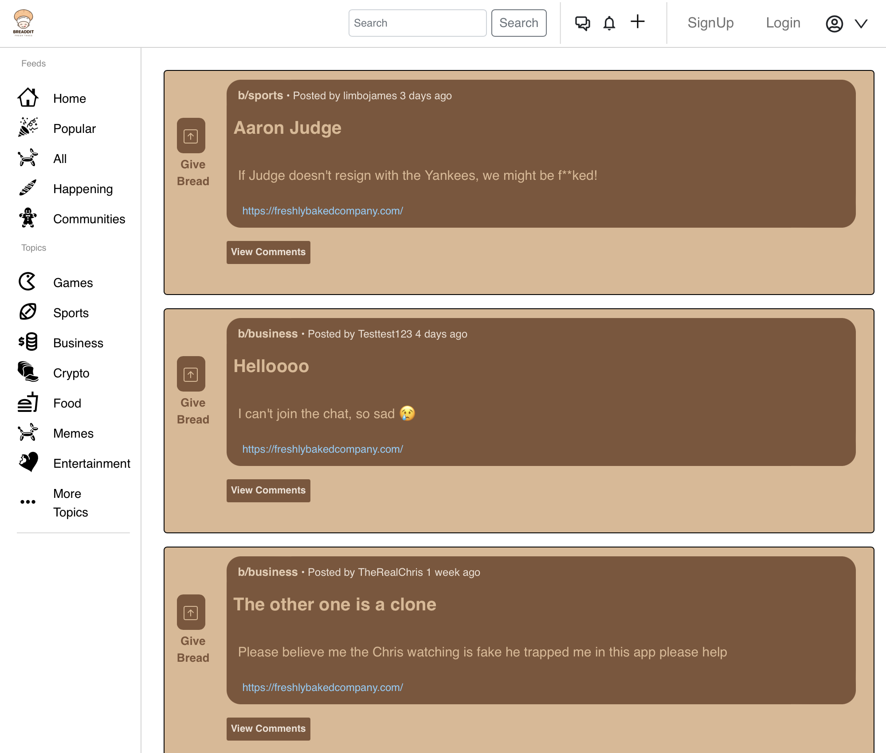

# Breddit

### A "Better Reddit" clone with a bread-themed twist.

- [Deployed Site](https://breddit.netlify.app/)
- [Backend Repo](https://github.com/SEI-Buffleheads/BetterReddit-Backend)

 

 

1. Overview
2. Key Features
3. Languages & Frameworks Used
4. Meet the Team

### 1. Overview:

Welcome to Breddit! Your source for all the hot gossip on a bread-themed Reddit clone. Users can browse through the feed or sub-topics and create an account to post and add comments.

### 2. Key Features:

- Full CRUD – create, read, update, and delete posts and comments
- News Feed and Sub-topics
- User authentication to login
  - Logging in is the only way users can create posts and comments
- Live Chat to connect with other users

### 3. Languages, Frameworks, & Methods Used

- Fontend: React.js, HTML5, CSS3
- Backend: Python, Django, PostgreSQL
- "Feature Branch" Git workflow

### 4. Meet the Team:

Breddit was our cohort's final project in General Assembly's Software Engineering Immersive.

Our team of 10 developers:
- Erin Baright
- Tashon Forrester
- Brandon Alvarez
- Victor Apaez
- Danny Yu
- Khris Patrick
- Connor Harris
- Nichole De La Rosa
- Jean Reyes
- Sandy Joriel
